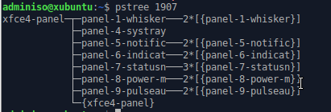
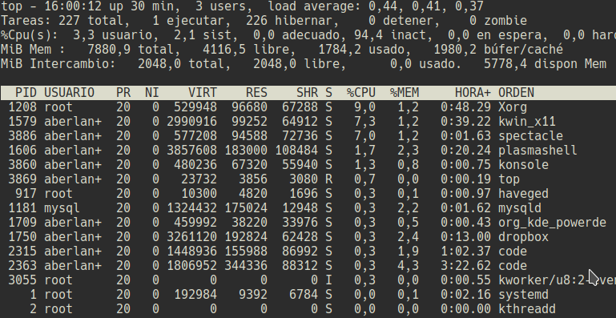
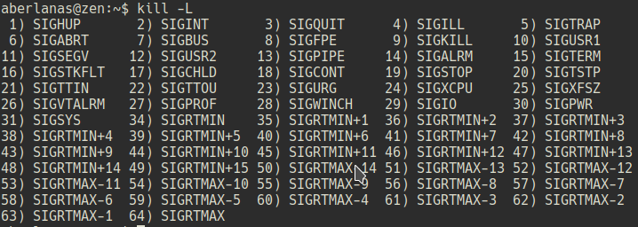

# Administración de Procesos y Red
# Procesos

Además de los Usuarios, Grupos y los Permisos, una de las tareas de las que tiene que ocuparse el Sistema Operativo es la gestión de los procesos.

Como administradores debemos saber manejar también los procesos, como se ponen en marcha y las herramientas de las que disponemos para interactuar con ellos.

## ¿Qué es un Proceso? 

 "Un  proceso  es  programa en ejecución". Desde el punto de vista del SO, un proceso es un objeto más que hay que gestionar y al cual hay que dar servicio.

Cuando un programa se pone en ejecución, el sistema operativo comprueba los permisos de los que dispone y se le asigna espacio en la memoria RAM y tiempo de computación, es decir, cierta prioridad en la CPU, para que el proceso pueda acceder a sus instrucciones y realizar la tarea que tiene programada.

La gestión de como funcionan internamente los procesos es muy complicada, ya que debemos tener en cuenta la carga del sistema, el planificador de procesos, los accesos a disco y periféricos, etc. 

Sin embargo, debemos saber como obtener información del sistema operativo acerca de un determinado proceso, ya sea para comprobar que todo está bien, para hacer una auditoría de seguridad, comprobar su consumo de red, etc.

## Procesos en GNU/LinuX

Al igual que en los sistemas Windows, en GNU/LinuX disponemos de herramientas graficas que nos permiten manipular los procesos. Sin embargo en este apartado vamos a trabajar con los mismos conceptos que hemos visto antes, pero desde una terminal.

### Comando ps

`ps` nos muestra información acerca de los procesos que están activos actualmente en el sistema. Ejemplo:

`ps -e`

nos devolverá una salida similar a esta:

```shell

  PID TTY          TIME CMD
    1 ?        00:00:02 systemd
    2 ?        00:00:00 kthreadd
    4 ?        00:00:00 kworker/0:0H
    6 ?        00:00:00 mm_percpu_wq
  ....         ........ ..........
 1716 ?        00:00:01 xfce4-terminal
 1721 pts/0    00:00:00 bash
23368 ?        00:00:00 cupsd
23369 ?        00:00:00 cups-browsed
23785 pts/0    00:00:00 ps
```

>**NOTA**: Aparecerán muchos más procesos en marcha, pero he recortado la presentación por comodidad.

-----

Si queremos _filtrar_ la salida de `ps` basta con que entubemos la salida de `ps` a la entrada de `grep`.

Ejemplos:

```shell
ps -e | grep firefox
ps -e | grep mousepad
ps -e | grep update-manager
```

De esta manera obtendremos tan solo los PIDs de los procesos seleccionados, recordar que los PIDs son los números que identifican de manera única a los procesos dentro del Sistema Operativo.

### Comando pstree

Muestra el árbol de subprocesos que ha lanzado determinado proceso. Por ejemplo, en caso del panel indicador de Xfce4 (sería algo similar a _Cortana_ en Windows), podemos ver cuáles han sido los procesos que ha lanzado dicho panel. Para ello, ejecutaremos los siguientes comandos:

```shell
ps -e | grep xfce4-panel
o
ps -e | grep mate-panel
```

En mi caso esto genera una salida similar a esta:

```shell
 1907 ?        00:00:00 xfce4-panel
```

Obtendremos el PID del proceso xfce4-panel y se lo pasaremos como argumento a `pstree`:

```shell
pstree 1907
```

Que nos devolverá una salida como esta:


\ 

### Comando top

Nos muestra en _directo_ el estado de los procesos en nuestro sistema, así como el consumo de la CPU, el tiempo en ejecución (_uptime_), la memória RAM disponible, consumida, etc.

```shell
top
```

Ejecución:




### Comando kill

El comando `kill` nos permite enviarle señales a los procesos. Estas señales nos permiten modificar el estado de los procesos.

Una lista posible de las señales que le podemos enviar a un proceso nos la muestra el propio `kill` al pasarle la opción : `-L`:

`kill -L`

Salida:



Una de las opciones más comunes es la opción 9: `SIGKILL` que _termina_ el proceso que se le indica. 

Ejemplo de uso:

_El usuario quiere detener el programa mousepad que parece no responder, para ello ejecuta las siguientes ordenes:_

```shell
ps -e | grep mousepad
o
ps -e | grep pluma
```

Salida:

```shell
23895 pts/0    00:00:00 mousepad
```

Obtiene el PID de mousepad y se lo pasa a `kill` con el parámetro `-9 `

```shell
kill -9 23895
```

Y `mousepad` termina.

----

### Comando killall

`killall` funciona de una manera similar a `kill`, pero detiene todas las instancias de un proceso cuyo nombre sea el que se pasa como argumento.

Ejemplo:

`killall firefox`

Detendrá todos los firefox lanzados.

----

### Comando nice

Como administradores de sistemas, muchas veces comprobaremos que determinados procesos no tienen la misma prioridad, o no necesitamos que consuman todo la CPU cuando se realicen, ya que tampoco es requerido que acaben lo antes posible, y otros que sin embargo es necesario que se ejecuten rápidamente y con mucha prioridad para que el proceso acabe lo antes posible.

En GNU/LinuX contamos con el comando `nice` que nos permite establecer la prioridad con la que se ejecutará un proceso. 

La prioridad se establece mediante un argumento númerico que va desde el -20 (prioridad máxima) a 19 (prioridad mínima), siendo `0` el valor por defecto que el SO le asigna a un proceso.

Si ejecutamos `nice` sin parámetros veremos el nivel de prioridad (_niceness_) actual del proceso.

Si ejecutamos:

```shell
# nice 10 bash
nice
```

Obtendremos el valor :

`10`

¿Serías capaz de explicar que está pasando en este caso?

