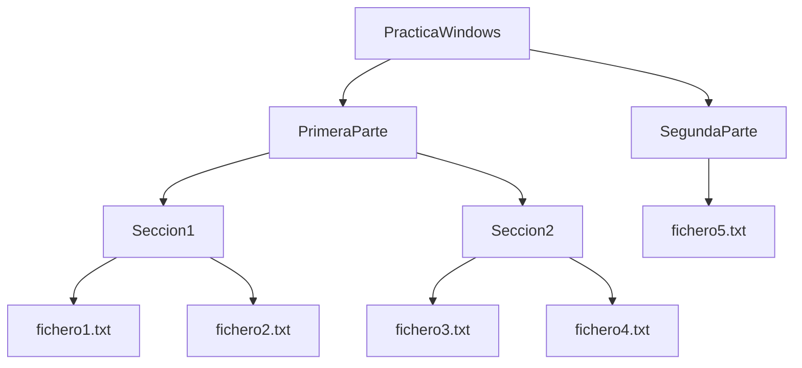

# Práctica: Gestión de Ficheros en CMD
## Crear la estructura de directorios

## 1 Crear directorios. En el directorio de usuario crea la misma estructura de carpetas que se muestra en la figura (solo las carpetas). Sin cambiar de carpeta, es decir, ejecutando los comandos siempre desde la carpeta de usuario C:\Users\nombreusuario

## 2. Cambia de directorio a  Seccion1. Recordá que cuando comenzás a escribir el nombre de un fichero o carpeta en el intérprete, la tecla TAB lo completa. Una vez en la carpeta Seccion1 ejecuta desde la línea de comandos el editor notepad. Inserta en el fichero la frase “Este es el contenido del fichero 1” y guardarlo con nombre fichero1.txt tal y como se muestra en la figura.

## 3.Repetimos la operación anterior con fichero2.txt pero en lugar de crearlo con el editor primero crea un duplicado de fichero1.txt con nombre fichero2.txt con el comando cp. Abri el nuevo fichero con el editor y modifica el texto para que diga “... del fichero 2”.

## 4.Repetir este último paso, pero ahora tienes que crear los ficheros fichero3.txt y fichero4.txt en la carpeta Seccion2. Ejecuta los comandos pertinentes en el intérprete (creación de duplicado y edición utilizando notepad) sin cambiar de directorio de trabajo (sección 1). Debes, por tanto, utilizar las rutas de los nuevos ficheros de tal forma que reflejen su nueva situación en la jerarquía de carpetas.

## 5. Cambia el directorio de trabajo en el intérprete con un único comando para pasar de la carpeta Seccion1 a la carpeta SegundaParte. Ejecuta ahora los comandos necesarios para crear un duplicado de cualquiera de los cuatro ficheros creados hasta ahora y modifica su contenido de manera análoga a como lo has hecho en el apartado anterior. De nuevo, no debes cambiar tu directorio de trabajo. Recordar que mientras escribis los nombres de los ficheros y los caminos, la tecla tabulador puede ser útil para completar nombres.

## 6. Por último, la carpeta Seccion2 no queremos que esté en ese nivel, sino al nivel de las carpetas PrimeraParte y SegundaParte. Por tanto, desde el directorio superior PracticaLinux ejecuta un único comando que mueve la carpeta Seccion2 a su nuevo lugar con nombre TerceraParte.
